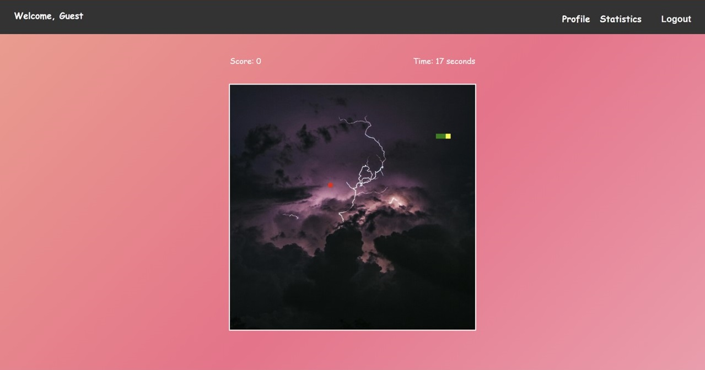

# โครงการ CT_648_final

## บทนำ
โครงการนี้เป็นส่วนหนึ่งของวิชา CT648 เป็นการพัฒนาเว็บแอปพลิเคชันที่ถูกสร้างขึ้นเพื่อเป็นตัวอย่างการออกแบบ ระบบเว็บที่มีการรับ-ส่ง api และระบบฐานข้อมูล

User for test<br>
Username : admin <br>
password : admin

### แผนภาพโครงสร้าง


### รายละเอียด

หน้า Homepage ที่มี Link ไปที่หน้า Login และ Create account


หน้า Create account ส่ง Api ไปที่ server เพื่อตรวจสอบข้อมูลซ้ำและบันทึกข้อมูลสมาชิกลงไปในฐานข้อมูล(username, email และ password) มี Link ไปที่หน้า Login และ link บน navbar สำหรับกลับไปหน้า Homepage


หน้า Login ตรวจสอบข้อมูลสมาชิกโดยการส่ง Api ไปให้ server ตรวจสอบข้อมูลสมาชิกในฐานข้อมูล(username และ password) เมื่อ Login สำเร็จ(username และ password ตรงกับข้อมูลสมาชิกที่มีอยู่ในฐานข้อมูลสมาชิก)ระบบจะส่งไปที่หน้า Lobby พร้อมทั้งส่งข้อมูลชื่อผู้ใช้ มี Link ไปที่หน้า Create account และ link บน navbar สำหรับกลับไปหน้า Homepage


หน้า Lobby เป็นหน้าสำหรับสมาชิกที่ผ่านการ Login เข้ามา มี link ไปที่หน้า snakegame มี navbar ที่มีชื่อสมาชิกแสดงที่ด้านซ้ายและ Link ไปหน้า statistics และ Logout(ออกจากระบบและกลับไปที่หน้า Homepage)


หน้า snakegame เป็นหน้าสำหรับเล่นเกม เมื่อเล่นเกมจบ(Gameover) จะส่ง Api ไปที่ server เพื่อบันทึกสถิติการเล่น(username score, time, date) มี navbar ที่มีชื่อสมาชิกแสดงที่ด้านซ้ายและ Link ไปหน้า statistics และ Logout(ออกจากระบบและกลับไปที่หน้า Homepage)



หน้า snakegame จะนำ api จากเว็ป unsplash.com มาใช้เป็นพื้นหลังของบอร์ดเกม


หน้า statistics เป็นหน้าสำหรับดูข้อมูลสถิติการเล่นของ user โดยจะส่ง Api ไปที่ server เพื่อขอข้อมูลสถิติการเล่นที่บันทึกไว้(username score, time, date) มาโชว์บนตาราง มี link กลับไปที่หน้า lobby และมี navbar ที่มีชื่อสมาชิกแสดงที่ด้านซ้ายและ Link ไปหน้า statistics และ Logout(ออกจากระบบและกลับไปที่หน้า Homepage)


### โครงสร้างโปรเจค
```bash
2
├── my project
│   ├── public
│   │   └── pic
│   │       ├── game.png
│   │       └── game1.jpg
│   └── src
│       ├── components
│       │   ├── homepage
│       │   │   └── index.tsx
│       │   ├── lobby
│       │   │   └── index.tsx
│       │   ├── login
│       │   │   └── index.tsx
│       │   ├── signup
│       │   │   └── index.tsx
│       │   ├── snakegame
│       │   │   ├── index.tsx
│       │   │   └── index.css
│       │   ├── statistics
│       │   │   └── index.tsx
│       │   └── navbar.tsx
│       ├── App.jsx
│       ├── index.css
│       └── ...
├── server
│   ├── confifg
│   │   └── db.ts
│   ├── models   
│   │   ├── Statistic.ts
│   │   └── user.ts
│   ├── routes   
│   │   ├── auth.ts
│   │   └── statistic.ts
│   │── .env   
│   ├── Dockerfile
│   ├── server.ts
│   ├── tsconfig.json   
│   └── ...
├── docker-compose.yaml
└── ...
```

### คำอธิบายโครงสร้างโปรเจค
- my project จะเป็นส่วนของ front-end ที่ใช้ React ในการพัฒนา คำสั่งสร้าง 
   ```bash
   bun create vite
   ```
   
- server จะเป็นส่วนของ back-end ที่ใช้ express + bun runtime ในการพัฒนา
- database จะใช้ postgresql ในการเก็บข้อมูล
- ในการ deploy จะใช้ docker ในการสร้าง image และใช้ docker-compose ในการสร้าง container ของ my project, server และ database

## วิธีการติดตั้ง
1. โคลน repository:
   ```bash
   git clone https://github.com/safetybabyboy/CT_648_final.git
   ```

2. เข้าไปยังโฟลเดอร์โปรเจกต์:
   ```bash
   cd CT_648_final
   ```

   สิ่งที่ต้องแก้ไขเพิ่มเติมในการนำไปใช้งาน
   -ทำการเปลี่ยน การรับส่ง api จาก localhost:5000 เป็น (ip จริง):5000 ในไฟล์ index.tsx ส่วนของ front-end
   -ลบไฟล์ postgres-data ถ้าจำเป็นเพื่อสร้างตารางใหม่
   -เปิดพอร์ตต่างๆที่จำเป็นต่อการใช้งาน เช่น port:3000 สำหรับ front-end / port:5000 สำหรับ back-end หรือ server ฯ 

   ใช้คำสั่งเหล่านี้ในกรณีนำไปใช้งานบน ubuntu
   1.อัปเดตรายการแพ็กเกจ
   ```bash
   sudo apt update
   ```

   2.ติดตั้งแพ็กเกจที่จำเป็น
      ```bash
   sudo apt install apt-transport-https ca-certificates curl software-properties-common
   ```

   3.เพิ่ม Docker GPG Key
   ```bash
   curl -fsSL https://download.docker.com/linux/ubuntu/gpg | sudo gpg --dearmor -o /usr/share/keyrings/docker-archive-keyring.gpg
   ```

   4.เพิ่ม Docker APT Repository
      ```bash
   echo "deb [arch=$(dpkg --print-architecture) signed-by=/usr/share/keyrings/docker-archive-keyring.gpg] https://download.docker.com/linux/ubuntu $(lsb_release -cs) stable" | sudo tee /etc/apt/sources.list.d/docker.list > /dev/null
   ```

   5.อัปเดตรายการแพ็กเกจอีกครั้ง
   ```bash
   sudo apt update
   ```

   6.ติดตั้ง Docker Engine
   ```bash
   sudo apt install docker-ce
   ```

   7.ตรวจสอบการติดตั้ง Docker
   ```bash
   docker --version
   ```

   8.ตรวจสอบและติดตั้ง Docker Compose เวอร์ชันล่าสุด
   ```bash
   sudo curl -L "https://github.com/docker/compose/releases/latest/download/docker-compose-$(uname -s)-$(uname -m)" -o /usr/local/bin/docker-compose
   ```

   9.ให้สิทธิ์การรันไฟล์ Docker Compose      
   ```bash
   sudo chmod +x /usr/local/bin/docker-compose
   ```

   10.ตรวจสอบการติดตั้ง    
   ```bash
   docker-compose --version
   ```

   11.ติดตั้ง Git  
   ```bash
   sudo apt install git
   ```

   12.ตรวจสอบการติดตั้ง Git 
   ```bash
   git --version
   ```

   13.ตั้งค่า Git เบื้องต้น (แนะนำ) ตั้งค่าชื่อผู้ใช้และอีเมลสำหรับ Git ซึ่งจะใช้กับการ commit
   ```bash
   git config --global user.name "Your Name"
   git config --global user.email "your-email@example.com"
   ```

3. รัน Docker:
   ```bash
   docker-compose up --build
   ```
