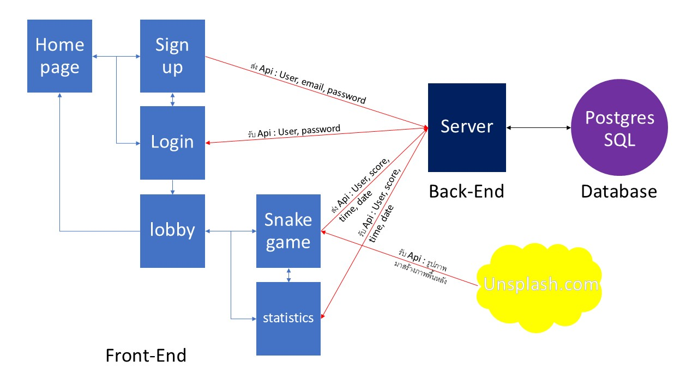

# โครงการ CT_648_final

## บทนำ
โครงการนี้เป็นส่วนหนึ่งของวิชา CT648 เป็นการพัฒนาเว็บแอปพลิเคชันที่ถูกสร้างขึ้นเพื่อเป็นตัวอย่างการออกแบบ ระบบเว็บที่มีการรับ-ส่ง api และระบบฐานข้อมูล

### แผนภาพโครงสร้าง


### รายละเอียด

หน้า Homepage ที่มี Link ไปที่หน้า Login และ Create account


หน้า Create account ส่ง Api ไปที่ server เพื่อตรวจสอบข้อมูลซ้ำและบันทึกข้อมูลสมาชิกลงไปในฐานข้อมูล(username, email และ password) มี Link ไปที่หน้า Login และ link บน navbar สำหรับกลับไปหน้า Homepage


หน้า Login ตรวจสอบข้อมูลสมาชิกโดยการส่ง Api ไปให้ server ตรวจสอบข้อมูลสมาชิกในฐานข้อมูล(username และ password) เมื่อ Login สำเร็จ(username และ password ตรงกับข้อมูลสมาชิกที่มีอยู่ในฐานข้อมูลสมาชิก)ระบบจะส่งไปที่หน้า Lobby พร้อมทั้งส่งข้อมูลชื่อผู้ใช้ มี Link ไปที่หน้า Create account และ link บน navbar สำหรับกลับไปหน้า Homepage


หน้า Lobby เป็นหน้าสำหรับสมาชิกที่ผ่านการ Login เข้ามา มี link ไปที่หน้า snakegame มี navbar ที่มีชื่อสมาชิกแสดงที่ด้านซ้ายและ Link ไปหน้า statistics และ Logout(ออกจากระบบและกลับไปที่หน้า Homepage)


หน้า snakegame เป็นหน้าสำหรับเล่นเกม เมื่อเล่นเกมจบ(Gameover) จะส่ง Api ไปที่ server เพื่อบันทึกสถิติการเล่น(username score, time, date) มี navbar ที่มีชื่อสมาชิกแสดงที่ด้านซ้ายและ Link ไปหน้า statistics และ Logout(ออกจากระบบและกลับไปที่หน้า Homepage)


หน้า statistics เป็นหน้าสำหรับดูข้อมูลสถิติการเล่นของ user โดยจะส่ง Api ไปที่ server เพื่อขอข้อมูลสถิติการเล่นที่บันทึกไว้(username score, time, date) มาโชว์บนตาราง มี link กลับไปที่หน้า lobby และมี navbar ที่มีชื่อสมาชิกแสดงที่ด้านซ้ายและ Link ไปหน้า statistics และ Logout(ออกจากระบบและกลับไปที่หน้า Homepage)


### โครงสร้างโปรเจค
```bash
2
├── my project
│   ├── public
│   │   └── pic
│   │       ├── game.png
│   │       └── game1.jpg
│   └── src
│       ├── components
│       │   ├── homepage
│       │   │   └── index.tsx
│       │   ├── lobby
│       │   │   └── index.tsx
│       │   ├── login
│       │   │   └── index.tsx
│       │   ├── signup
│       │   │   └── index.tsx
│       │   ├── snakegame
│       │   │   ├── index.tsx
│       │   │   └── index.css
│       │   ├── statistics
│       │   │   └── index.tsx
│       │   └── navbar.tsx
│       ├── App.jsx
│       ├── index.css
│       └── ...
├── server
│   ├── confifg
│   │   └── db.ts
│   ├── models   
│   │   ├── Statistic.ts
│   │   └── user.ts
│   ├── routes   
│   │   ├── auth.ts
│   │   └── statistic.ts
│   │── .env   
│   ├── Dockerfile
│   ├── server.ts
│   ├── tsconfig.json   
│   └── ...
├── docker-compose.yaml
└── ...
```

### คำอธิบายโครงสร้างโปรเจค
- my project จะเป็นส่วนของ front-end ที่ใช้ React ในการพัฒนา คำสั่งสร้าง 
   ```bash
   bun create vite
   ```
   
- server จะเป็นส่วนของ back-end ที่ใช้ express + bun runtime ในการพัฒนา
- database จะใช้ postgresql ในการเก็บข้อมูล
- ในการ deploy จะใช้ docker ในการสร้าง image และใช้ docker-compose ในการสร้าง container ของ my project, server และ database

## วิธีการติดตั้ง
1. โคลน repository:
   ```bash
   git clone https://github.com/safetybabyboy/CT_648_final.git
   ```


2. เข้าไปยังโฟลเดอร์โปรเจกต์:
   ```bash
   cd CT_648_final
   ```

3. รัน Docker:
   ```bash
   docker-compose up --build
   ```
